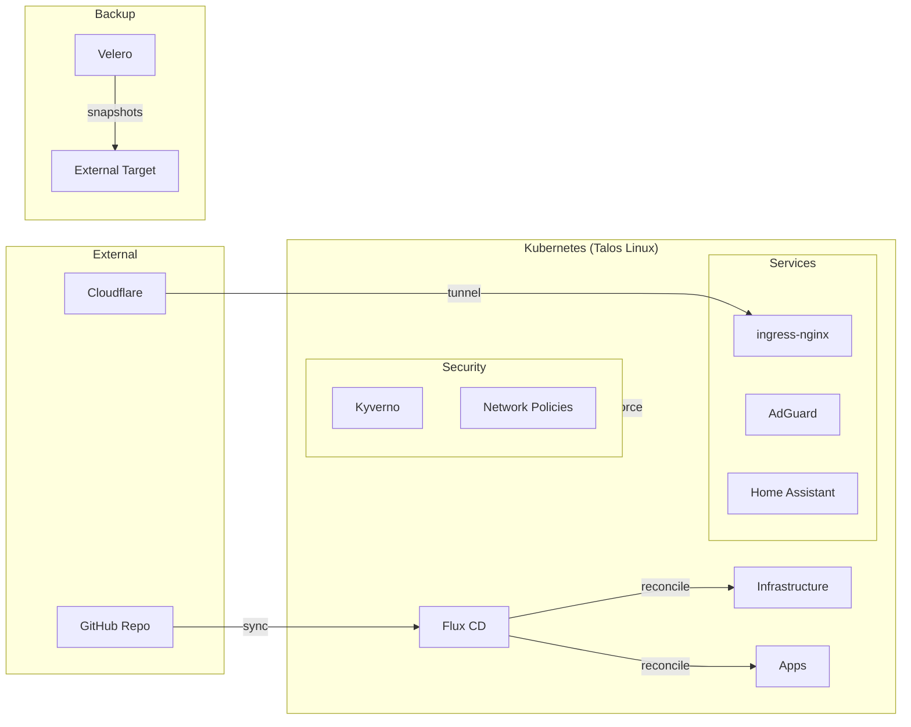

# homelab-minerva-minerva

[](https://github.com/<user>/homelab-minerva/actions/workflows/lint.yml)


> GitOps-managed single-node Kubernetes cluster on bare metal, powered by Talos Linux and Flux CD.

## Architecture



## Hardware

| Component | Spec |
|-----------|------|
| CPU | Intel i3-10100 (4C/8T) |
| RAM | 64GB DDR4-3200 |
| Storage | 4TB NVMe |
| Case | Fractal Ridge ITX |
| PSU | Silverstone SX500-G |

## Tech Stack

| Layer | Tools |
|-------|-------|
| OS | Talos Linux |
| GitOps | Flux CD, Renovate |
| Networking | ingress-nginx, MetalLB, ExternalDNS, Cloudflare Tunnels |
| Security | SOPS/age, cert-manager, Kyverno, NetworkPolicies, Trivy Operator |
| Storage | Longhorn |
| Backup | Velero |
| Monitoring | Prometheus, Grafana, Loki, Alertmanager |
| DNS | AdGuard Home |
| Automation | Home Assistant |
| Operations | Reloader, Flux notifications |
| IaC | Ansible (bootstrap), Terraform (Cloudflare) |

## Prerequisites

```
talosctl kubectl flux sops age task ansible pre-commit kubeconform velero
```

## Quick Start

1. **Generate an age key** — `task sops:age-keygen` and add the public key to `.sops.yaml`
2. **Configure SOPS** — set `SOPS_AGE_KEY_FILE` to point to your private key
3. **Bootstrap Talos** — update `ansible/inventory/hosts.yml` with your node IP and run `ansible-playbook ansible/playbooks/talos-bootstrap.yml`
4. **Bootstrap Flux** — fill in `GITHUB_OWNER` in `Taskfile.yml` and run `task flux:bootstrap`
5. **Verify** — `flux get all` and `kubectl get nodes`

## Repo Structure

```
homelab-minerva/
├── .github/              # CI workflows, PR template, Renovate config
├── docs/                 # Architecture docs and ADRs
├── ansible/              # Inventory and bootstrap playbooks
├── talos/                # Machine configs and patches
├── kubernetes/
│   ├── flux-system/      # Flux bootstrap (managed by Flux)
│   ├── infrastructure/
│   │   ├── controllers/  # cert-manager, ingress-nginx, external-dns, metallb, kyverno, reloader
│   │   ├── configs/      # cert-manager issuers, metallb pools, network policies
│   │   ├── security/     # Kyverno policies, Trivy Operator
│   │   ├── storage/      # Longhorn
│   │   └── backup/       # Velero
│   ├── monitoring/       # kube-prometheus-stack, Loki
│   └── apps/             # adguard, home-assistant, cloudflared
└── terraform/            # Cloudflare DNS and tunnel config
```

## Documentation

- [Architecture Overview](docs/architecture.md)
- [Architecture Decision Records](docs/adr/)

## License

[MIT](LICENSE)
test
test
test
clean line
clean line
clean line
