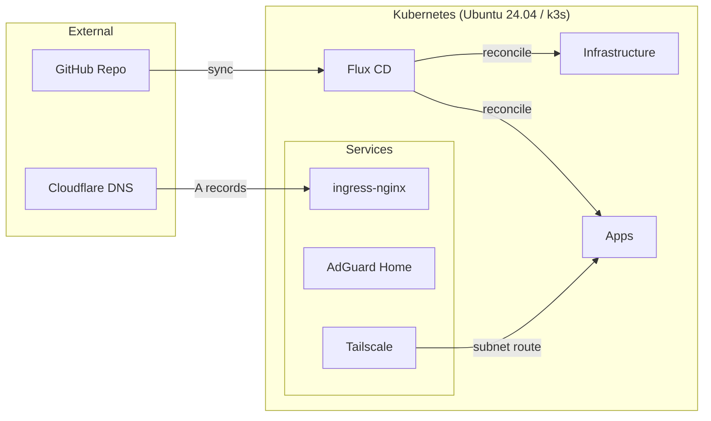

# homelab-minerva

[](https://github.com/bryion/homelab-minerva/actions/workflows/lint.yml)


> GitOps-managed single-node Kubernetes cluster on bare metal, powered by Ubuntu 24.04, k3s, and Flux CD.

## Architecture



## Hardware

| Component | Spec |
|-----------|------|
| CPU | Intel i3-10100 (4C/8T) |
| RAM | 64GB DDR4-3200 |
| Storage | 4TB NVMe |
| Case | Fractal Ridge ITX |
| PSU | Silverstone SX500-G |

## Tech Stack

| Layer | Tools |
|-------|-------|
| OS | Ubuntu 24.04 LTS + k3s |
| GitOps | Flux CD, Renovate |
| Ingress | ingress-nginx (hostPort 80/443) |
| TLS | cert-manager (Let's Encrypt via Cloudflare DNS-01) |
| Storage | local-path-provisioner (k3s built-in) |
| Monitoring | Prometheus, Grafana, Alertmanager |
| DNS | AdGuard Home, Cloudflare (A records via Terraform) |
| Remote Access | Tailscale (subnet router) |
| Operations | Reloader |
| Secrets | SOPS + age |
| IaC | Ansible (provisioning), Terraform (Cloudflare DNS) |

## Prerequisites

```
kubectl flux sops age task ansible pre-commit kubeconform yamllint
```

## Quick Start

1. **Generate an age key** — `task sops:age-keygen` and add the public key to `.sops.yaml`
2. **Configure SOPS** — set `SOPS_AGE_KEY_FILE` to point to your private key
3. **Bootstrap node** — update `ansible/inventory/hosts.yml` with your node IP and run `task node:bootstrap`
4. **Bootstrap Flux** — fill in `GITHUB_OWNER` in `Taskfile.yml` and run `task flux:bootstrap`
5. **Verify** — `flux get all` and `kubectl get nodes`

## Repo Structure

```
homelab-minerva/
├── .github/              # CI workflows, PR template, Renovate config
├── docs/                 # Architecture docs and ADRs
├── ansible/              # Inventory and provisioning playbooks
├── kubernetes/
│   ├── flux-system/      # Flux bootstrap (managed by Flux)
│   ├── infrastructure/
│   │   ├── controllers/  # ingress-nginx, cert-manager, reloader
│   │   └── configs/      # cert-manager issuers
│   ├── monitoring/       # kube-prometheus-stack
│   └── apps/             # adguard, tailscale
└── terraform/            # Cloudflare DNS A records
```

## Documentation

- [Architecture Overview](docs/architecture.md)
- [Architecture Decision Records](docs/adr/)

## License

[MIT](LICENSE)
