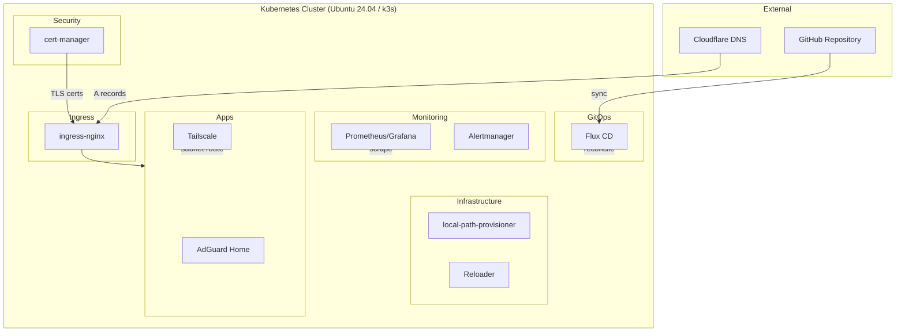

# Architecture

## Overview

## Layers

**External** — Cloudflare provides DNS only. Per-service A records point `service.nlab.casa` to the node's LAN IP. Traffic stays local — Cloudflare only serves DNS responses.

**Ingress** — ingress-nginx handles HTTP routing on ports 80/443 via hostPort. Routes requests by hostname to the correct backend service.

**Security** — cert-manager provisions Let's Encrypt TLS certificates via Cloudflare DNS-01 challenge. All secrets in Git are encrypted with SOPS + age.

**Infrastructure** — local-path-provisioner (k3s built-in) provides node-local persistent volumes. Reloader watches ConfigMaps and Secrets to trigger rolling restarts.

**Monitoring** — Prometheus scrapes metrics, Grafana visualizes them, Alertmanager routes alerts.

**Apps** — AdGuard Home for DNS-level ad blocking (port 53 via hostPort), Tailscale for remote access via subnet routing.

## DNS Flow

Per-service A records in Cloudflare (managed via Terraform) point `service.nlab.casa` to the node's LAN IP. Browsers resolve the hostname locally, hit ingress-nginx on the node, which routes to the correct service. cert-manager provisions valid Let's Encrypt certs via DNS-01, so browsers show no security warnings. All traffic stays on the local network.

## Security Model

All secrets in Git are encrypted with SOPS using age keys. TLS is enforced on all ingress via cert-manager with Let's Encrypt. Network policies and additional hardening are deferred until needed.
