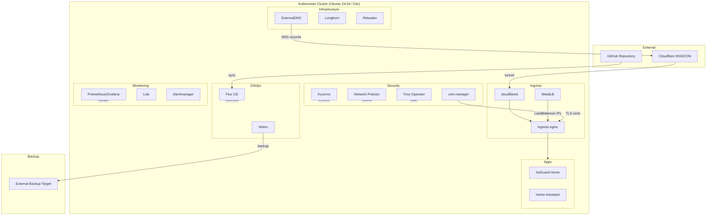

# Architecture

## Overview

## Layers

**External** — Cloudflare provides DNS, CDN, and DDoS protection. A `cloudflared` tunnel connects the cluster to the internet without exposing any ports.

**Ingress** — ingress-nginx handles HTTP routing. MetalLB assigns LoadBalancer IPs on the local network. ExternalDNS synchronizes Ingress hostnames to Cloudflare DNS records.

**Security** — Kyverno enforces admission policies (no root, required labels, image allowlists). Network policies default to deny-all with explicit per-service allow rules. cert-manager provisions TLS certificates via Let's Encrypt. Trivy Operator continuously scans container images for vulnerabilities.

**Infrastructure** — Longhorn provides replicated persistent storage. Reloader watches ConfigMaps and Secrets to trigger rolling restarts when configuration changes.

**Monitoring** — Prometheus scrapes metrics, Grafana visualizes them, Loki aggregates logs, Alertmanager routes alerts.

**Apps** — AdGuard Home for DNS-level ad blocking, Home Assistant for home automation, with room to grow.

## Network Flow

DNS resolution works in two paths. For remote access, Cloudflare resolves the public domain to its edge, which routes through the `cloudflared` tunnel to ingress-nginx inside the cluster. For local access, AdGuard Home or a local DNS server resolves `*.nlab.casa` to the MetalLB LoadBalancer IP, hitting ingress-nginx directly. In both cases, ingress-nginx terminates TLS (certs from cert-manager) and routes to the appropriate backend service.

## Security Model

Every namespace starts with a default-deny NetworkPolicy. Services must explicitly declare what ingress and egress they need. Kyverno ClusterPolicies enforce: no privileged containers, no root users, required resource limits, image registries restricted to ghcr.io/docker.io/quay.io, and required `app.kubernetes.io` labels. All secrets in Git are encrypted with SOPS using age keys. TLS is enforced on all ingress via cert-manager with Let's Encrypt.

## Backup Strategy

Velero runs on a daily schedule backing up all namespaces and cluster-scoped resources. Persistent volume data is captured via Longhorn snapshots. Recovery procedure: install Velero on a fresh cluster, point it at the backup target, run `velero restore create --from-backup <latest>`, then verify workloads come up and PVCs rebind to restored Longhorn volumes.
