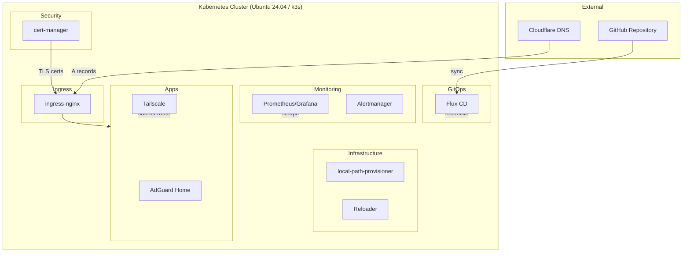
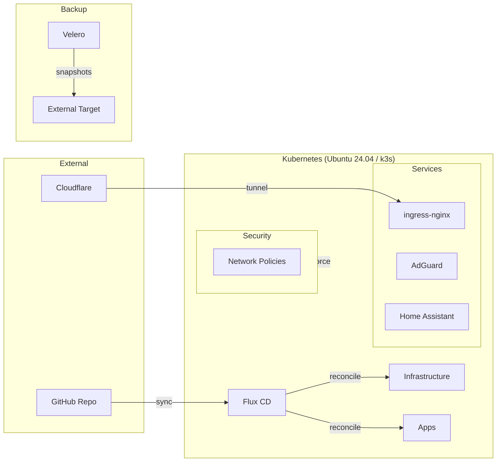
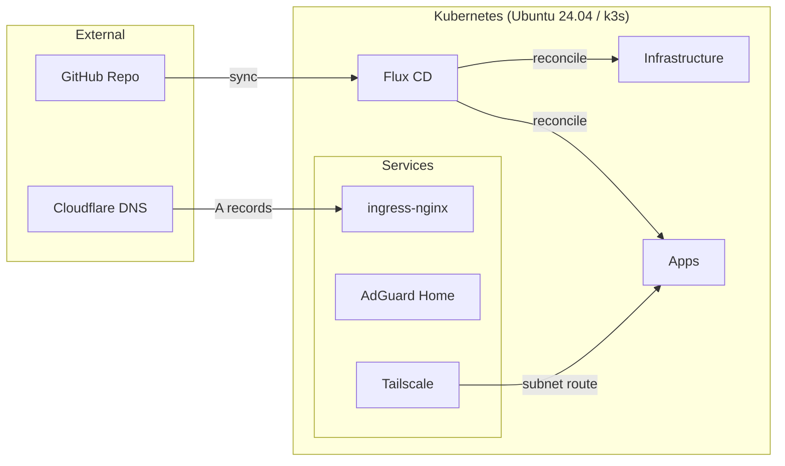

# Repo Refactor Implementation Plan

> **For agentic workers:** REQUIRED: Use superpowers:subagent-driven-development (if subagents available) or superpowers:executing-plans to implement this plan. Steps use checkbox (`- [ ]`) syntax for tracking.

**Goal:** Strip the repo down to essential components for a single-node k3s homelab with internal-only access, valid TLS, and minimal complexity.

**Architecture:** Remove placeholder directories and docs for components that don't serve the stripped-down design (MetalLB, ExternalDNS, Cloudflare tunnels, Velero, NetworkPolicies, Kyverno, Calico, Home Assistant). Update architecture docs and phase plan to match. Add Tailscale placeholder.

**Tech Stack:** YAML, Markdown, Task CLI

**Spec:** `docs/superpowers/specs/2026-03-18-repo-refactor-design.md`

---

## Chunk 1: Repo Cleanup and Documentation Update

### Task 1: Remove unnecessary Kubernetes directories

These directories contain only placeholder READMEs — no manifests to migrate.

**Files:**
- Delete: `kubernetes/infrastructure/controllers/metallb/README.md`
- Delete: `kubernetes/infrastructure/controllers/external-dns/README.md`
- Delete: `kubernetes/infrastructure/controllers/calico/README.md`
- Delete: `kubernetes/infrastructure/configs/metallb/README.md`
- Delete: `kubernetes/infrastructure/configs/external-dns/README.md`
- Delete: `kubernetes/infrastructure/configs/network-policies/default-deny.yaml`
- Delete: `kubernetes/infrastructure/configs/flux-notifications/README.md`
- Delete: `kubernetes/infrastructure/backup/velero/README.md`
- Delete: `kubernetes/apps/cloudflared/README.md`
- Delete: `kubernetes/apps/home-assistant/README.md`

- [ ] **Step 1: Delete removed infrastructure controller placeholders**

```bash
git rm kubernetes/infrastructure/controllers/metallb/README.md
git rm kubernetes/infrastructure/controllers/external-dns/README.md
git rm kubernetes/infrastructure/controllers/calico/README.md
```

- [ ] **Step 2: Delete removed infrastructure config placeholders**

```bash
git rm kubernetes/infrastructure/configs/metallb/README.md
git rm kubernetes/infrastructure/configs/external-dns/README.md
git rm kubernetes/infrastructure/configs/network-policies/default-deny.yaml
git rm kubernetes/infrastructure/configs/flux-notifications/README.md
```

- [ ] **Step 3: Delete removed backup and app placeholders**

```bash
git rm -r kubernetes/infrastructure/backup/
git rm kubernetes/apps/cloudflared/README.md
git rm kubernetes/apps/home-assistant/README.md
```

- [ ] **Step 4: Add Tailscale app placeholder**

Create `kubernetes/apps/tailscale/README.md`:

```markdown
# Tailscale

Subnet router for remote access to cluster services via Tailscale VPN.

Deployed in Phase 3.
```

- [ ] **Step 5: Verify directory structure**

```bash
find kubernetes/ -type f | sort
```

Expected output should show only:
- `kubernetes/flux-system/gotk-sync.yaml`
- `kubernetes/flux-system/README.md`
- `kubernetes/infrastructure/controllers/ingress-nginx/README.md`
- `kubernetes/infrastructure/controllers/cert-manager/README.md`
- `kubernetes/infrastructure/controllers/reloader/README.md`
- `kubernetes/infrastructure/configs/cert-manager/README.md`
- `kubernetes/monitoring/kube-prometheus-stack/README.md`
- `kubernetes/apps/adguard/README.md`
- `kubernetes/apps/tailscale/README.md`

- [ ] **Step 6: Commit**

```bash
git add -A kubernetes/
git commit -m "refactor: remove unused kubernetes component placeholders

Remove MetalLB, ExternalDNS, Calico, cloudflared, Home Assistant,
Velero, flux-notifications, network-policies. Add Tailscale placeholder."
```

---

### Task 2: Remove superseded ADRs

**Files:**
- Delete: `docs/adr/0001-use-talos-linux.md`
- Delete: `docs/adr/0005-kyverno-for-policy-enforcement.md`
- Keep: `docs/adr/0004-network-policy-default-deny.md` (deferred, referenced by ADR-0006)
- Keep: `docs/adr/template.md`

- [ ] **Step 1: Delete superseded ADRs**

```bash
git rm docs/adr/0001-use-talos-linux.md
git rm docs/adr/0005-kyverno-for-policy-enforcement.md
```

- [ ] **Step 2: Verify remaining ADRs**

```bash
ls docs/adr/
```

Expected: `0002-use-flux-over-argocd.md`, `0003-single-node-with-namespaces.md`, `0004-network-policy-default-deny.md`, `0006-ubuntu-2404-with-k3s.md`, `template.md`

- [ ] **Step 3: Commit**

```bash
git add docs/adr/
git commit -m "refactor: remove superseded ADRs (Talos, Kyverno)

Keep ADR-0004 (network policies) as deferred — referenced by ADR-0006."
```

---

### Task 3: Trim Taskfile

**Files:**
- Modify: `Taskfile.yml`

- [ ] **Step 1: Remove Velero tasks from Taskfile.yml**

Delete lines 92-102 (the `velero:backup` and `velero:restore` tasks):

```yaml
  # --- Velero ---
  velero:backup:
    desc: Trigger a manual Velero backup
    cmds:
      - velero backup create manual-{{now | date "20060102-150405"}} --wait

  velero:restore:
    desc: List available Velero restores
    cmds:
      - velero backup get
      - velero restore get
```

- [ ] **Step 2: Verify Taskfile is valid**

```bash
task --list
```

Expected: 11 tasks listed (no `velero:backup` or `velero:restore`)

- [ ] **Step 3: Commit**

```bash
git add Taskfile.yml
git commit -m "refactor: remove Velero tasks from Taskfile

Velero/backups are deferred — not in scope for the stripped-down stack."
```

---

### Task 4: Rewrite architecture.md

**Files:**
- Modify: `docs/architecture.md`

- [ ] **Step 1: Replace architecture.md with updated content**

Write the entire file `docs/architecture.md` with the following content (note: the file contains mermaid code fences):

````markdown
# Architecture

## Overview



## Layers

**External** — Cloudflare provides DNS only. Per-service A records point `service.nlab.casa` to the node's LAN IP. Traffic stays local — Cloudflare only serves DNS responses.

**Ingress** — ingress-nginx handles HTTP routing on ports 80/443 via hostPort. Routes requests by hostname to the correct backend service.

**Security** — cert-manager provisions Let's Encrypt TLS certificates via Cloudflare DNS-01 challenge. All secrets in Git are encrypted with SOPS + age.

**Infrastructure** — local-path-provisioner (k3s built-in) provides node-local persistent volumes. Reloader watches ConfigMaps and Secrets to trigger rolling restarts.

**Monitoring** — Prometheus scrapes metrics, Grafana visualizes them, Alertmanager routes alerts.

**Apps** — AdGuard Home for DNS-level ad blocking (port 53 via hostPort), Tailscale for remote access via subnet routing.

## DNS Flow

Per-service A records in Cloudflare (managed via Terraform) point `service.nlab.casa` to the node's LAN IP. Browsers resolve the hostname locally, hit ingress-nginx on the node, which routes to the correct service. cert-manager provisions valid Let's Encrypt certs via DNS-01, so browsers show no security warnings. All traffic stays on the local network.

## Security Model

All secrets in Git are encrypted with SOPS using age keys. TLS is enforced on all ingress via cert-manager with Let's Encrypt. Network policies and additional hardening are deferred until needed.
````

- [ ] **Step 2: Verify markdown renders correctly**

```bash
head -5 docs/architecture.md
```

Expected: `# Architecture` header and content present.

- [ ] **Step 3: Commit**

```bash
git add docs/architecture.md
git commit -m "docs: rewrite architecture to match stripped-down stack

Remove MetalLB, ExternalDNS, cloudflared, Velero, NetworkPolicies.
Add Tailscale. Simplify DNS flow to internal-only with Cloudflare A records."
```

---

### Task 5: Rewrite status.md

**Files:**
- Modify: `docs/status.md`

- [ ] **Step 1: Replace status.md with updated content**

```markdown
# Project Status: homelab-minerva

**Date:** 2026-03-18
**Current Phase:** Phase 0 (Complete)

## Phase 0 Checklist

- [x] All CLI tools installed (kubectl, flux, sops, age, task, pre-commit, kubeconform, ansible, yamllint)
- [x] Age keypair generated and SOPS configured
- [x] Pre-commit hooks installed and passing
- [x] Commitlint configured with conventional commits
- [x] Git remote connected to GitHub
- [x] CI lint workflow active on PRs
- [x] Taskfile with automation tasks
- [x] Architecture decisions documented (ADRs)
- [x] Repo refactored to essential components only

## Architecture Overview

Single-node k3s cluster on bare metal (Ubuntu 24.04 LTS), managed via Flux CD GitOps. Services accessible at `service.nlab.casa` with valid Let's Encrypt TLS (internal only). Remote access via Tailscale. DNS managed via Cloudflare A records (per-service, managed by Terraform).

## Phase Plan

| Phase | Description | Status |
|-------|-------------|--------|
| 0 | Workstation setup + repo scaffold | COMPLETE |
| 1 | Ubuntu 24.04 + k3s + Flux + ingress-nginx + cert-manager + Reloader | NOT STARTED |
| 2 | Monitoring (Prometheus, Grafana, Alertmanager) | NOT STARTED |
| 3 | Apps + access (AdGuard Home, Tailscale) | NOT STARTED |
| 4 | Future apps (Mealie, Jellyfin, etc.) | NOT STARTED |

## Hardware

| Component | Spec |
|-----------|------|
| CPU | Intel Core i3-10100 (4c/8t) |
| RAM | 64 GB DDR4-3200 |
| Storage | 4 TB NVMe (Crucial P3) |
| Case | Fractal Design Ridge Mini ITX |
| PSU | Silverstone SX500-G 500W SFX |
| Motherboard | MSI MPG B560I Gaming Edge WiFi |

## Tech Stack

### Deployed
- **Workstation:** kubectl, flux, sops, age, task, pre-commit, kubeconform, ansible, yamllint
- **CI/CD:** GitHub Actions (lint workflow), Renovate (dependency updates)
- **Secrets:** SOPS + age encryption

### Planned
- **OS:** Ubuntu 24.04 LTS + k3s
- **GitOps:** Flux CD
- **Ingress:** ingress-nginx (hostPort 80/443)
- **TLS:** cert-manager (Let's Encrypt via Cloudflare DNS-01)
- **DNS:** Cloudflare A records (managed via Terraform)
- **Storage:** local-path-provisioner (k3s built-in)
- **Monitoring:** Prometheus, Grafana, Alertmanager (kube-prometheus-stack)
- **Apps:** AdGuard Home
- **Remote Access:** Tailscale (subnet router)
- **Utilities:** Reloader

## Next Steps

Phase 1 begins with Ubuntu 24.04 LTS + k3s installation on the bare metal machine:

1. Install Ubuntu 24.04 LTS Server on the bare metal node
2. Update `ansible/inventory/hosts.yml` with the node IP
3. Run `task node:bootstrap` to harden the OS and install k3s
4. Bootstrap Flux CD with `task flux:bootstrap`
5. Deploy ingress-nginx, cert-manager, and Reloader
6. Set up Terraform for Cloudflare DNS A records
7. Verify HTTPS works with valid Let's Encrypt cert
```

- [ ] **Step 2: Commit**

```bash
git add docs/status.md
git commit -m "docs: rewrite status with simplified phase plan

Four phases: platform, monitoring, apps+access, future apps.
Remove references to MetalLB, ExternalDNS, Velero, NetworkPolicies."
```

---

### Task 6: Update README.md

The README currently references the full stack. It needs to align with the stripped-down design.

**Files:**
- Modify: `README.md`

- [ ] **Step 1: Read current README.md**

Read the full file to understand current structure and content.

- [ ] **Step 2: Replace the Architecture mermaid diagram**

Replace the existing mermaid diagram block (lines 11-40) with the simplified version. Old:

````markdown

````

New:

````markdown

````

- [ ] **Step 3: Replace the Tech Stack table**

Old:

```
| Layer | Tools |
|-------|-------|
| OS | Ubuntu 24.04 LTS + k3s |
| GitOps | Flux CD, Renovate |
| Networking | ingress-nginx, MetalLB, ExternalDNS, Cloudflare Tunnels |
| Security | SOPS/age, cert-manager, NetworkPolicies |
| Storage | local-path-provisioner (k3s built-in) |
| Backup | Velero |
| Monitoring | Prometheus, Grafana, Alertmanager |
| DNS | AdGuard Home |
| Automation | Home Assistant |
| Operations | Reloader, Flux notifications |
| IaC | Ansible (provisioning + maintenance), Terraform (Cloudflare) |
```

New:

```
| Layer | Tools |
|-------|-------|
| OS | Ubuntu 24.04 LTS + k3s |
| GitOps | Flux CD, Renovate |
| Ingress | ingress-nginx (hostPort 80/443) |
| TLS | cert-manager (Let's Encrypt via Cloudflare DNS-01) |
| Storage | local-path-provisioner (k3s built-in) |
| Monitoring | Prometheus, Grafana, Alertmanager |
| DNS | AdGuard Home, Cloudflare (A records via Terraform) |
| Remote Access | Tailscale (subnet router) |
| Operations | Reloader |
| Secrets | SOPS + age |
| IaC | Ansible (provisioning), Terraform (Cloudflare DNS) |
```

- [ ] **Step 4: Replace the Prerequisites line**

Old:

```
kubectl flux sops age task ansible pre-commit kubeconform velero
```

New:

```
kubectl flux sops age task ansible pre-commit kubeconform yamllint
```

- [ ] **Step 5: Replace the Repo Structure tree**

Old:

```
homelab-minerva/
├── .github/              # CI workflows, PR template, Renovate config
├── docs/                 # Architecture docs and ADRs
├── ansible/              # Inventory and provisioning playbooks
├── kubernetes/
│   ├── flux-system/      # Flux bootstrap (managed by Flux)
│   ├── infrastructure/
│   │   ├── controllers/  # cert-manager, ingress-nginx, external-dns, metallb, reloader
│   │   ├── configs/      # cert-manager issuers, metallb pools, network policies
│   │   ├── storage/      # local-path-provisioner config
│   │   └── backup/       # Velero
│   ├── monitoring/       # kube-prometheus-stack
│   └── apps/             # adguard, home-assistant, cloudflared
└── terraform/            # Cloudflare DNS and tunnel config
```

New:

```
homelab-minerva/
├── .github/              # CI workflows, PR template, Renovate config
├── docs/                 # Architecture docs and ADRs
├── ansible/              # Inventory and provisioning playbooks
├── kubernetes/
│   ├── flux-system/      # Flux bootstrap (managed by Flux)
│   ├── infrastructure/
│   │   ├── controllers/  # ingress-nginx, cert-manager, reloader
│   │   └── configs/      # cert-manager issuers
│   ├── monitoring/       # kube-prometheus-stack
│   └── apps/             # adguard, tailscale
└── terraform/            # Cloudflare DNS A records
```

- [ ] **Step 6: Verify README renders correctly**

```bash
head -20 README.md
```

- [ ] **Step 7: Commit**

```bash
git add README.md
git commit -m "docs: update README to match stripped-down stack

Remove references to MetalLB, ExternalDNS, cloudflared, Velero,
NetworkPolicies. Add Tailscale. Simplify architecture diagram."
```

---

### Task 7: Run validation and verify clean state

- [ ] **Step 1: Run YAML linting**

```bash
task validate:yaml
```

Expected: No errors

- [ ] **Step 2: Run Kubernetes manifest validation**

```bash
task validate:k8s
```

Expected: No errors (most manifests are placeholder READMEs, only the Flux sync YAML is validated)

- [ ] **Step 3: Run pre-commit hooks on all files**

```bash
pre-commit run --all-files
```

Expected: All hooks pass

- [ ] **Step 4: Verify git status is clean**

```bash
git status
```

Expected: `nothing to commit, working tree clean`

- [ ] **Step 5: Verify final directory structure**

```bash
find . -type f -not -path './.git/*' -not -path './node_modules/*' | sort
```

Verify the output matches the target structure from the spec.
